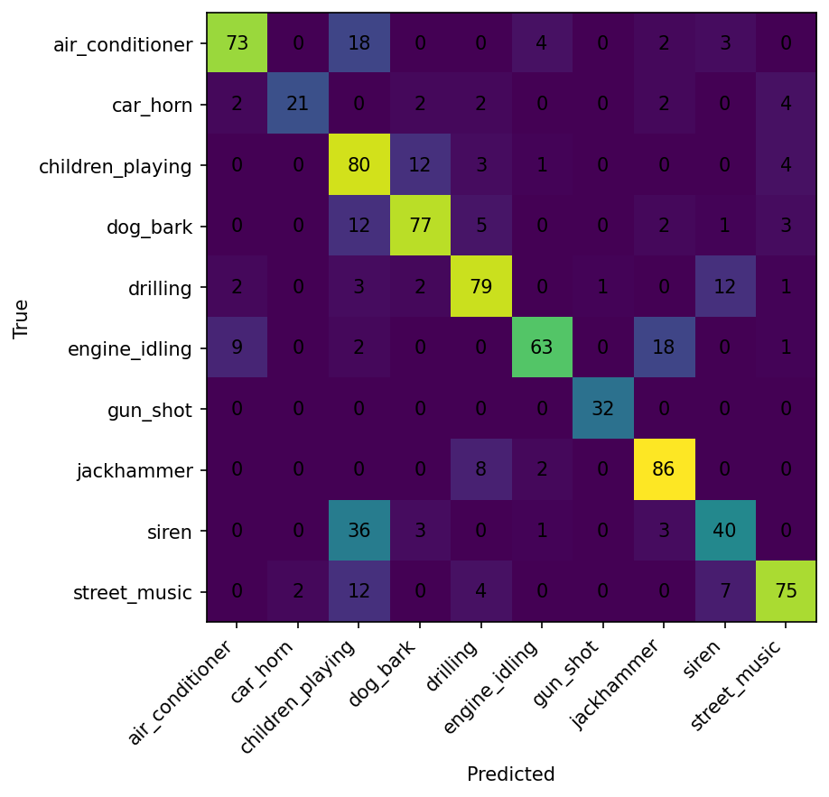

# CSC4005 Lab 4 Report – CRNN for UrbanSound8K

## 1. Thông tin sinh viên

- Họ tên: Đỗ Lê Mạnh Hùng
- Mã sinh viên: 1671040014
- Lớp: KHMT 16-01
- Link GitHub repo: https://github.com/FIT-DNU-CS-16-01/csc4005-lab4-Pangorin#
- Link W&B project: https://wandb.ai/15sofme-dai-nam-university/csc4005-lab4-urbansound8k-crnn

## 2. Mục tiêu thí nghiệm
- Dùng log-mel spectrogram vì với CRNN, log-mel spectrogram thường trực quan hơn vì nó giữ được cấu trúc thời gian–tần số.
- 1D-CNN nhận diện cực nhanh các sự kiện âm thanh cục bộ, trong khi CRNN kết hợp thêm bộ nhớ để hiểu ngữ cảnh của các chuỗi âm thanh dài liên tục.
- Mục tiêu đánh giá mô hình: nhận xét về loss & accuracy của tập train, validation, quan sát xem có dấu hiệu overfitting hay underfitting hay không.

## 3. Cấu hình dữ liệu

| Thành phần | Giá trị |
|---|---|
| Dataset | UrbanSound8K |
| Số lớp | 10 |
| Train folds | 1–8 |
| Validation fold | 9 |
| Test fold | 10 |
| Feature | log-mel spectrogram |
| Sampling rate | 16 kHz |
| Duration | 4 giây |

## 4. Cấu hình mô hình

| Thành phần | Giá trị |
|---|---|
| Model | CRNN |
| CNN blocks | ? |
| RNN type | GRU / LSTM |
| Hidden size | 96 |
| Dropout | 0.3 |
| Optimizer | adamw |
| Learning rate | 0.0001 |
| Batch size | 32 |
| Epochs | 25 |

## 5. Kết quả huấn luyện

Điền kết quả tốt nhất từ W&B hoặc `metrics.json`.

| Run | best_val_acc | test_acc | Ghi chú |
|---|---:|---:|---|
| logmel_crnn_gru_baseline | 0.7401960784313726 | 0.7479091995221028 | |
| extension_bilstm_crnn | | | |

## 6. Learning curves

.

Nhận xét:

- Mô hình có dấu hiệu overfitting, bắt đầu từ khoảng epoch 15 trở đi, đường `train_loss` tiếp tục giảm đều và `train_acc` tăng, nhưng `val_loss` có dấu hiệu đi ngang và khoảng cách giữa tập train và tập val bắt đầu giãn rộng.
- Validation loss không giảm ổn định. Đường `val_loss` và cả `val_acc` dao động khá nhiều qua các epoch chứ không mượt, đặc biệt ở giai đoạn nửa sau.
- Có cần early stopping khoảng quanh epoch 15-20, vì sau điểm này mô hình gần như không cải thiện.

## 7. Confusion matrix

Nhận xét:

- Lớp phân loại tốt: `gun_shot`, `jackhammer`, `children_playing`, `drilling`.
- Lớp dễ bị nhầm: `siren` bị nhầm rất nhiều với `children_playing`, hay `engine_idling` dễ bị nhầm thành `jackhammer`.
- Có, mô hình phân biệt tốt các âm thanh xung/ngắt quãng đột ngột. Tuy nhiên, nó dễ bị nhầm lẫn giữa các âm thanh có cùng dải tần số cao/chói hoặc cùng dải trầm/vang cơ khí.